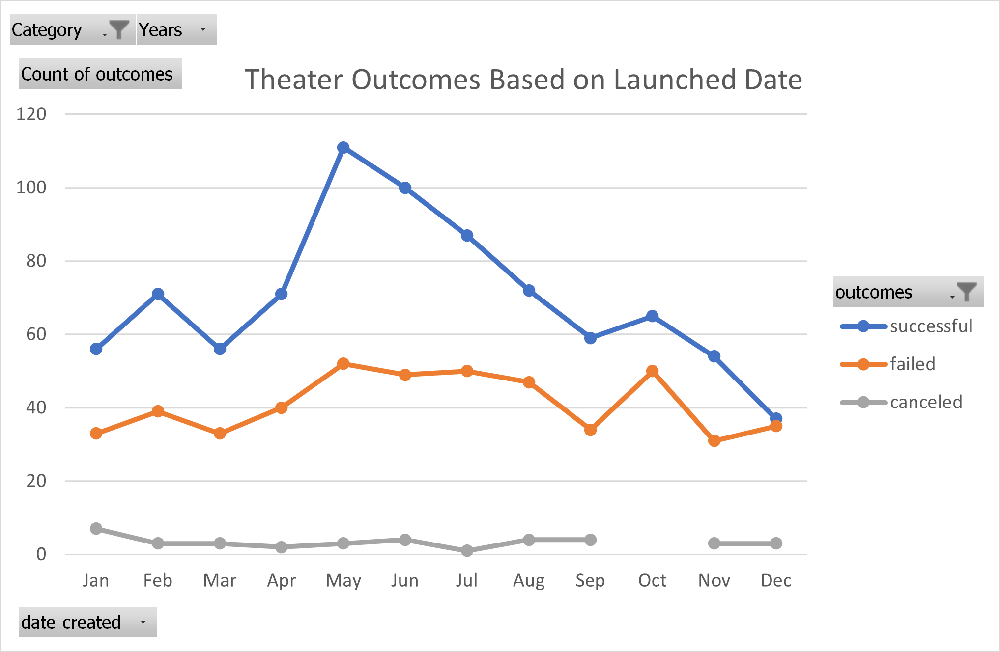
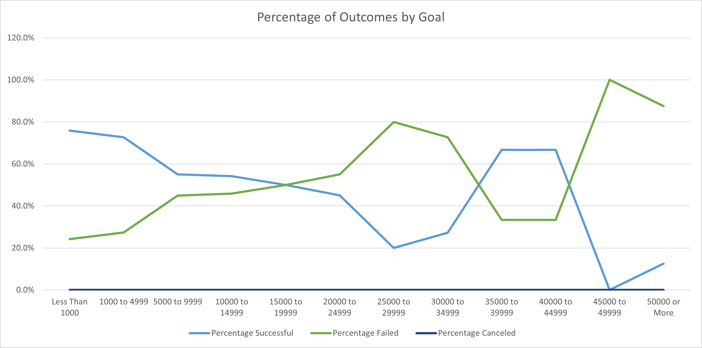

# Kickstarter Campaign Further Analysis

## Analysis of Outcomes based on Launched Date and Goal Amount

### Purpose
This further analysis of the kickstarter fundraising outcomes looks at the distribution of outcomes based on launched date and goal amount. The following report contains information on campaigns from all countries in the theater category, or specific subcategory of plays.  

## Analysis and Challenges

### Analysis of Outcomes Based on Launch Date

I analyzed all Theater campaigns by launched date: using a pivot table, I broke down the campaign start dates into groups by month and compared the successful, failed, and cancelled projects over the span of a year. 

The following line chart displays the progression of outcomes by month the campaign started. Although the data appears to be spanning 1 year, it is actually collecting data from multiple years, so I provided Louise the option to futher filter on year to explore the trendes year per year. 

### Analysis of Outcomes Based on Goals

To analayze the outcomes based on goals, I first broke down the data into ranges of goals. Each range spanned $5000, starting with $0 up to $50,000 and above. This will allow us to review data by the intended size of project, assuming that the smaller projects have smaller fundraising goals. This also sheds a little light into the possible outliers in our data set, particularly the projects over $50K, as there are significant more Total Projects in that range than in the other ranges over $25K. 

Next, I used the counts of successful/failed/cancelled outcomes by goal range to calculate the percentage of successful, failed, and canceled projects. These percentages are now displayed in a line chart where you can see the rise and fall of probability of a campaign to succeed as the goal gets higher. 

### Challenges and Difficulties Encountered

In this analysis we only looked at the outcomes of successful, failed, and cancelled. Note that in the play category, there were no canceled campaigns, which is why there are zero values for canceled outocmes in the line charts. Note that there are 19 live campaigns in the play subcategory, but we did not include those in our analysis. The live campaigns caused my numbers to be slightly off when comparing totals of outcomes per the "plays" subcategory. 

Outcomes by Launched Date Challenges:
1. In order to have the ability to filter on years in the outcomes by launched date pivot table, I needed to add a column for years to your original spreadsheet. I had to be careful that the selected data cells for the pivot table included the newly created column in order to be able to properly filter. 
2. When creating this pivot table, moving the "date created" object into the Rows box created rows in 3 groups: Year(2), Quarter, and Date. I removed the Year(2) and Quarter groups from the column section until only "Month" remained, even though the text in the Rows wiindow in the PivotTable Fields says "date created" 

Percentage Outcomes by Goal Challenges:
1. At first my total amounts were not lining up with the image provided in the instructions, so I double checked column E "Total Projects" by Column I, where I reused the COUNTIFS formula without filtering on outcome. This highlighted the several "Live" projects that were not included in my analysis. However, I also found that I had been incorrectly filtering on Country of US as well. Once I removed the COUNTIFS condition for US the values matched the image in instructions. 
2. The COUNTIFS criteria for the goal range took some thought and manipulation. In order to find the goals of 1000 to 4999, are the 1000 and 4999 numbers included in this range? I decided that both values should be included, as the next range will begin with the following value. I changed the first goal criteria to be >=1000 in order to include the first value. Then, I realized that the range had to extend up to the first value of the next range, so I changed the second goal criteria to be <5000, so that all values of 4999.99 were included in this range. My final COUNTIFS formula appeared as such:
=COUNTIFS(Kickstarter!$D:$D,">=1000",Kickstarter!$D:$D,"<5000",Kickstarter!$H:$H,"successful",Kickstarter!$R:$R,"plays")

## Results

### Conclusions of Outcomes based on Launch Date: 
1. The months of May and June prove to be the most successful month to launch a campaign. I recommend starting your campaign in middle to late May.
2. The last quarter of the year (October-December) shows steadily declining rates of success for fundraising campaigns. I recommend that you avoid beginning a campaign during these months, as there may be difficulties fundraising around the holiday season when potential funders are spending money on gifts and holiday celebrations and may have less disposable income. 

### Conclusions of Outcomes based on Goals?
Breaking down the goals into smaller groups of ranges sheds a little light into the possible outliers in our data set, particularly the projects over $50K, as there are significant more Total Projects in that range than in the other ranges over $25K. Looking at the projects with goals of $50K or higher, only 2 were successful while 14 were unsuccessful. However, it is difficult from this data only to say whether these campaigns failed because their goal was too high, or because they were not desireable projects for funders. 

This analysis further shows that the campaigns with smaller goals are more likely to succeed. The highest successrates were the first two goal ranges of less than $1000 and $5000-9999, which were each had a success rate of over 70%. I recommend that Louise set a fundraising goal of under $10K for this reason. Moving into the next goal range categories, those in between $10K and $25K, we see the success rate lowers to near 50%.

### Limitations of the dataset:

One major limitation of the dataset is that the success of a fundraising campaign is somewhat left up to subjectivity of the donors in the community of the project. If a project has a 20K goal, but is a very-well suited and significant project for the communicaty, the donors may be more inclined to donate and easily surpass the goal, whereas a 20K goal for a project that interests few people would be much more difficult to fund. While average donation helps us understand the desirability of a project, some projects may have had 1 or 2 special donors that provided the majority of the cost for the project, skewing the average donation.

The data in this Percentage Outcomes by Goal report has not been filtered by country, and since a play is often a cultural event, there could be different levels of support/popularity for plays in different countries. Additionally, the different currencies included in the data have not been normalized for exchange rate, which means that the goals in differet currencies are not appropriately aligned to their true range amount. It may be more helpful to limit this Outcomes by goal analysis by country, or to normalize the currency to USD. 

The limitation of comparing the create date by month and not looking at individual years is that in some years, donors are less likely to contribute. For example, campaigns typically receive less funding during a political campaign year, or one year could have been negatively impacted by an unforseen economic downturn caused by natural disaster for example. 

### Additional Charts and/or Tables to review:

Further analysis on the outcomes by launched date could include separate line charts looking at specific years. Also, we could further limit this data to show only Plays, as well as plays in only the US or other country. 

Further analysis on the outcomes by goal category would be to further break down the statistics for goal, pledged amount and average donation per each goal range category. Say that Louise finds that the cost of her project will likely be over $10K, then we would want to zoom into that category to find the mean, median and quartile data for the goal and pledged amount to find the ideal goal most likely to be funded. Average donation statistics can help her gauge how she wants to structure her fundraising materials and requests. 

Final spreadsheet can be viewed at:
[Kickstarter_Challenge.xlsx](Kickstarter_Challenge.xlsx)
